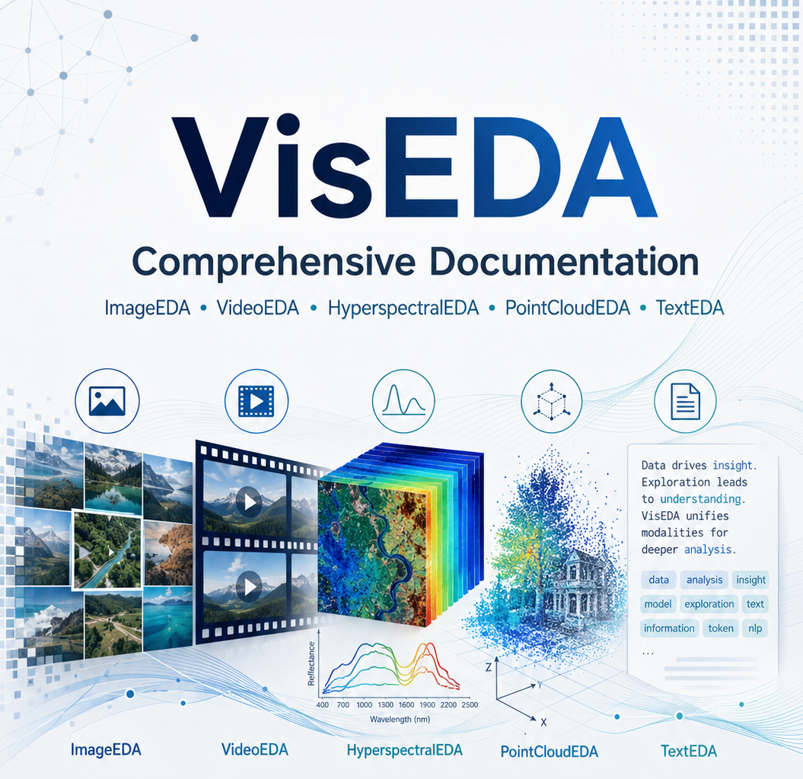

<div align="center">



# VisEDA

### Visual Exploratory Data Analysis for multimodal datasets

**ImageEDA · VideoEDA · HyperspectralEDA · PointCloudEDA · TextEDA**

[](https://pypi.org/project/viseda/)
[](https://pypi.org/project/viseda/)
[](LICENSE)

**One toolkit for inspecting, understanding, and validating visual and text datasets before modelling.**

</div>

---

## Overview

**VisEDA** is a Python toolkit for exploratory data analysis across five major data modalities:

| Module | Designed for | Core analyses |
|---|---|---|
| **ImageEDA** | Image datasets | size, aspect ratio, brightness, contrast, sharpness, noise, exposure, colour, texture, frequency, duplicates, class balance |
| **VideoEDA** | Video datasets | frame count, duration, FPS, temporal brightness/contrast, sharpness, blur, motion, scene changes, similarity |
| **HyperspectralEDA** | Hyperspectral cubes | band statistics, SNR, noise, dropout bands, vegetation/water indices, PCA, false colour, spectral diversity |
| **PointCloudEDA** | 3D point clouds | geometry, density, height, duplicates, outliers, nearest neighbours, PCA shape descriptors, cloud distances |
| **TextEDA** | Text/NLP datasets | document length, vocabulary, lexical diversity, readability, symbols, scripts, duplicates, TF-IDF distances, label analysis |

VisEDA is intended for **data scientists, researchers, students, and practitioners** who want a consistent EDA workflow before training machine-learning or deep-learning models.

---

## Why VisEDA?

Exploratory analysis is standard practice for tabular data, but visual and multimodal datasets often require separate tools and custom scripts.

VisEDA provides a unified interface for:

- **dataset inventory and integrity checks**
- **quality and distribution analysis**
- **class-balance inspection**
- **duplicate and similarity analysis**
- **per-sample and dataset-level visualisations**
- **self-contained HTML reports**
- **command-line workflows**
- **Python API workflows**
- **reproducible pre-model data auditing**

The goal is simple:

> **Understand the dataset before trusting the model.**

---

## Installation

Install the base package from PyPI:

```bash
pip install viseda
```

### Optional extras

For extended hyperspectral file support:

```bash
pip install "viseda[hyperspectral]"
```

For LAS/LAZ point-cloud support:

```bash
pip install "viseda[pointcloud]"
```

Install all optional dependencies:

```bash
pip install "viseda[all]"
```

Python **3.9+** is recommended.

---

# Quick Start


> **Important:** ImageEDA uses `plot()` for its comprehensive dataset dashboard.  
> VideoEDA, HyperspectralEDA, PointCloudEDA, and TextEDA expose `plot_dataset()` for dataset-level dashboards.

## ImageEDA

```python
from viseda import ImageEDA

eda = ImageEDA(verbose=True)

eda.load(
    "path/to/images",
    label_from_parent=True
)

summary = eda.summary()

print(summary["inventory"])
print(summary["quality"])

# ImageEDA's full dataset dashboard is plot(), not plot_dataset()
eda.plot(
    save_path="image_dashboard.png"
)

eda.report(
    "viseda_image_report.html"
)
```

For in-memory images:

```python
import numpy as np
from viseda import ImageEDA

images = [
    np.random.default_rng(0).integers(
        0, 256, size=(128, 128, 3), dtype=np.uint8
    ),
    np.random.default_rng(1).integers(
        0, 256, size=(128, 128, 3), dtype=np.uint8
    ),
]

eda = ImageEDA(
    verbose=False,
    compute_glcm=False,
    compute_freq=False,
)

eda.load_arrays(
    images,
    labels=["class_a", "class_b"]
)

print(eda.summary()["inventory"])

eda.plot(
    save_path="image_dashboard.png"
)
```

---

## VideoEDA

```python
from viseda import VideoEDA

eda = VideoEDA(
    verbose=True,
    frame_sample_rate=5
)

eda.load(
    "path/to/videos",
    label_from_parent=True
)

summary = eda.summary()

print(summary["inventory"])
print(summary["temporal"])
print(summary["motion"])

eda.plot_dataset(
    save_path="video_dashboard.png"
)

eda.report(
    "viseda_video_report.html"
)
```

For one video rather than the whole dataset:

```python
eda.plot(
    video_index=0,
    save_path="single_video.png"
)
```

---

## HyperspectralEDA

```python
import numpy as np
from viseda import HyperspectralEDA

# One wavelength value per spectral band
wavelengths = np.load(
    "path/to/wavelengths.npy"
)

eda = HyperspectralEDA(
    wavelengths=wavelengths,
    compute_glcm=False,
    compute_pca=True,
)

# File-backed loading is recommended when using compute_index()
# or pca_scores().
eda.load(
    "path/to/cube.npy"
)

summary = eda.summary()

print(summary["inventory"])
print(summary["spectral_quality"])

ndvi = eda.compute_index(
    cube_index=0,
    index_name="ndvi"
)

scores, variance_ratio = eda.pca_scores(
    cube_index=0,
    n_components=3
)

eda.plot(
    cube_index=0,
    save_path="hyperspectral_cube.png"
)

eda.report(
    "viseda_hyper_report.html"
)
```

For a directory of hyperspectral cubes:

```python
from viseda import HyperspectralEDA

eda = HyperspectralEDA()

eda.load(
    "path/to/hyperspectral_dataset",
    label_from_parent=True
)

eda.plot_dataset(
    save_path="hyperspectral_dataset.png"
)
```

> **Current 1.0.0 note:** `load_arrays()` is suitable for summary and plotting workflows, but `compute_index()` and `pca_scores()` reload the selected cube from its source path. Use `load()` with a file-backed cube when calling those two methods.

---

## PointCloudEDA

```python
import numpy as np
from viseda import PointCloudEDA

points = np.random.default_rng(0).random(
    (10000, 3)
).astype("float32")

eda = PointCloudEDA(
    max_points_per_cloud=200000,
    compute_neighbors=True,
    compute_geometry=True,
)

eda.load_arrays(
    [points],
    labels=["sample"]
)

summary = eda.summary()

print(summary["inventory"])
print(summary["geometry"])
print(summary["quality"])

eda.plot_dataset(
    save_path="pointcloud_dashboard.png"
)

eda.report(
    "viseda_pointcloud_report.html"
)
```

For an individual cloud:

```python
eda.plot(
    cloud_index=0,
    save_path="single_cloud.png"
)
```

---

## TextEDA

```python
from viseda import TextEDA

eda = TextEDA()

eda.load_texts(
    [
        "Exploratory data analysis should come before model training.",
        "TextEDA analyses vocabulary, length, readability and duplicates.",
    ],
    labels=["eda", "eda"],
)

summary = eda.summary()

print(summary["length"])
print(summary["lexical"])

print(
    eda.vocabulary(top_n=10)
)

eda.plot_dataset(
    save_path="text_dashboard.png"
)

eda.report(
    "viseda_text_report.html"
)
```

TextEDA also supports directory datasets and structured files such as CSV, TSV, JSON, JSONL, Markdown, HTML, and plain text.

---

# Command-Line Interface

VisEDA installs a unified command:

```bash
viseda --help
```

Available subcommands:

```text
viseda image ...
viseda video ...
viseda hyper ...
viseda cloud ...
viseda text ...
```

### Image dataset

```bash
viseda image "C:/datasets/images" \
    --label-from-parent \
    --plot \
    --report viseda_image_report.html
```

### Video dataset

```bash
viseda video "C:/datasets/videos" \
    --label-from-parent \
    --plot \
    --report viseda_video_report.html
```

### Hyperspectral dataset

```bash
viseda hyper "C:/datasets/hyper" \
    --label-from-parent \
    --plot \
    --dataset-plot \
    --report viseda_hyper_report.html
```

### Point-cloud dataset

```bash
viseda cloud "C:/datasets/pointclouds" \
    --label-from-parent \
    --plot \
    --report viseda_pointcloud_report.html
```

### Text dataset

```bash
viseda text "C:/datasets/text" \
    --label-from-parent \
    --plot \
    --report viseda_text_report.html
```

For command-specific options:

```bash
viseda image --help
viseda video --help
viseda hyper --help
viseda cloud --help
viseda text --help
```

---

# HTML Reports

Every VisEDA module can generate a standalone HTML report.

```python
eda.report("report.html")
```

Reports are designed to provide a portable summary of dataset properties and quality indicators that can be opened directly in a browser.

Typical report sections include:

- dataset inventory
- labels/classes
- spatial or structural statistics
- quality metrics
- modality-specific statistics
- duplicate/similarity information where applicable
- summary distributions
- analysis metadata

---

# Visualisation Workflows

The dataset-level dashboard method is module-specific:

```python
# ImageEDA
image_eda.plot()

# VideoEDA
video_eda.plot_dataset()

# HyperspectralEDA
hyper_eda.plot_dataset()

# PointCloudEDA
cloud_eda.plot_dataset()

# TextEDA
text_eda.plot_dataset()
```

Specialised plotting methods are also available for modality-specific tasks such as:

- sample previews
- colour analysis
- quality analysis
- temporal analysis
- spectral analysis
- PCA analysis
- point-cloud geometry
- vocabulary and n-gram frequency
- pairwise similarity/distance matrices

---

# Supported Input Formats

| Module | Main supported inputs |
|---|---|
| **ImageEDA** | JPG/JPEG, PNG, BMP, TIFF and other supported image formats |
| **VideoEDA** | MP4, AVI, MOV, MKV, WEBM, MPEG/MPG, M4V |
| **HyperspectralEDA** | NPY, NPZ, MAT, ENVI HDR/BIL/BIP/BSQ/ENVI, TIF/TIFF |
| **PointCloudEDA** | NPY, NPZ, TXT, CSV, XYZ, PTS, ASCII PLY, LAS/LAZ |
| **TextEDA** | TXT/TEXT, MD, RST, LOG, HTML/HTM, CSV/TSV, JSON, JSONL/NDJSON |

Some formats require optional dependencies.

---

# Typical Workflow

```text
Raw Dataset
    │
    ▼
Load with VisEDA
    │
    ▼
Dataset Inventory
    │
    ▼
Quality & Distribution Analysis
    │
    ▼
Duplicate / Similarity Checks
    │
    ▼
Visual Diagnostics
    │
    ▼
HTML Report
    │
    ▼
Preprocessing Decisions
    │
    ▼
Model Training
```

---

# Package Structure

```text
viseda/
├── image/
├── video/
├── hyperspectral/
├── pointcloud/
├── text/
├── report/
├── core/
├── utils/
├── cli.py
└── __init__.py
```

The main classes can be imported directly:

```python
from viseda import (
    ImageEDA,
    VideoEDA,
    HyperspectralEDA,
    PointCloudEDA,
    TextEDA,
)
```

---

# Development

Clone the repository and install in editable mode:

```bash
python -m pip install -e ".[dev]"
```

Run the tests:

```bash
python -m pytest
```

Build a distribution:

```bash
python -m pip install --upgrade build twine

python -m build
python -m twine check dist/*
```

---

# Documentation

The VisEDA documentation covers all five modules in detail, including:

- installation
- quick-start workflows
- complete metric explanations
- visualisation interpretation
- Python API
- command-line interface
- HTML reports
- test workflows
- advanced use cases
- troubleshooting
- API reference
- changelog and roadmap

---

# Citation

If you use **VisEDA** in your research, publication, dissertation, thesis, teaching, or software project, please cite the software as follows:

> **I.O.Agyemang, D. Acheampong, A.A.Baffour, & I. Adjei-Mensah**  
> *VisEDA: A Unified Visual Exploratory Data Analysis Toolkit for Image, Video, Hyperspectral, Point Cloud, and Text Data.*  
> GitHub repository: https://github.com/Isaac45/VisEDA

## Authors

**Isaac Osei Agyemang**  
Data Science and Big Data Technology, Stirling College, Chengdu University, Chengdu 610054, P.R. China

**Daniel Acheampong**  
Lutgert College, Florida Gulf Coast University, USA

**Adu Asare Baffour**  
School of Science and Engineering, University of Missouri-Kansas City, USA

**Isaac Adjei-Mensah**  
College of Artificial Intelligence, Yango University, Fuzhou 350015, P.R. China  
Fujian University Engineering Research Center of Spatial Data Mining and Applications, Yango University, Fuzhou 350015, P.R. China

## BibTeX

```bibtex
@software{agyemang_viseda,
  author = {
    Agyemang, Isaac Osei and
    Acheampong, Daniel and
    Baffour, Adu Asare and
    Adjei-Mensah, Isaac
  },
  title = {
    VisEDA: A Unified Exploratory Data Analysis Toolkit for
    Image, Video, Hyperspectral, Point Cloud, and Text Data
  },
  url = {https://github.com/Isaac45/VisEDA},
  year = {2026},
  version = {1.0.0},
  note = {Python software library}
}
```

> If a DOI or peer-reviewed VisEDA publication becomes available, this section can be updated with the formal publication details.

---

# Contributing

Contributions are welcome.

Useful contributions include:

- bug reports
- additional file-format support
- new EDA metrics
- additional visualisations
- documentation improvements
- performance optimisations
- tests and reproducible examples

Before proposing major API changes, please open an issue describing the motivation and expected behaviour.

---

# License

VisEDA is released under the **MIT License**.

See `LICENSE` for details.

---

<div align="center">

### VisEDA

**Explore first. Model second.**

ImageEDA · VideoEDA · HyperspectralEDA · PointCloudEDA · TextEDA

</div>
